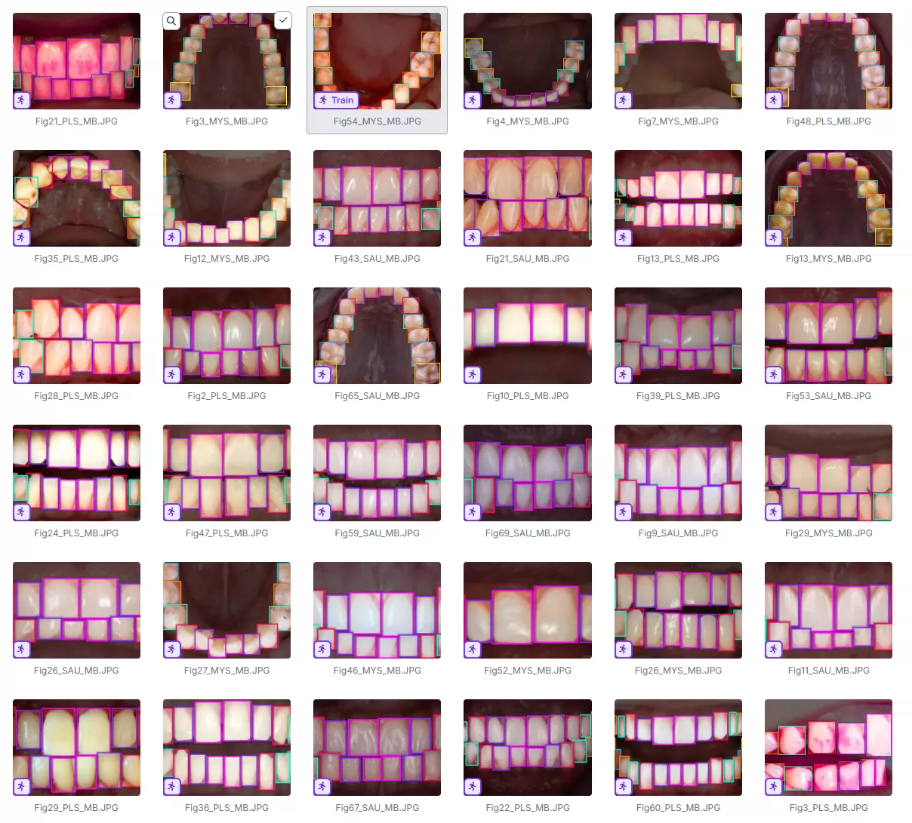
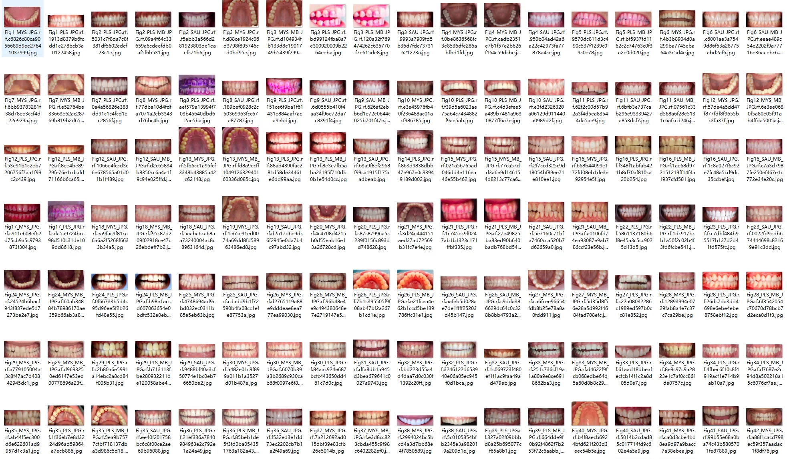
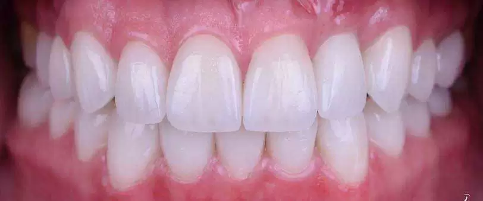
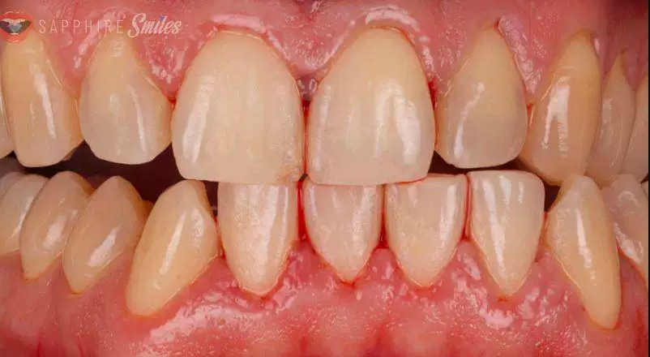
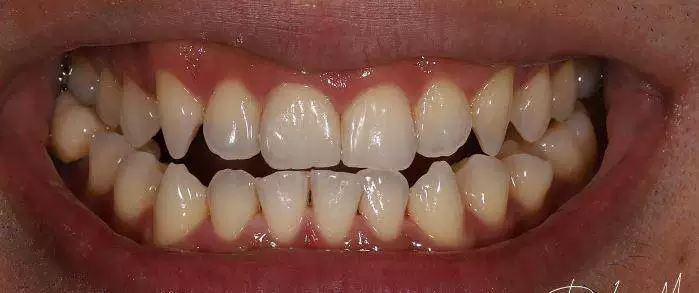
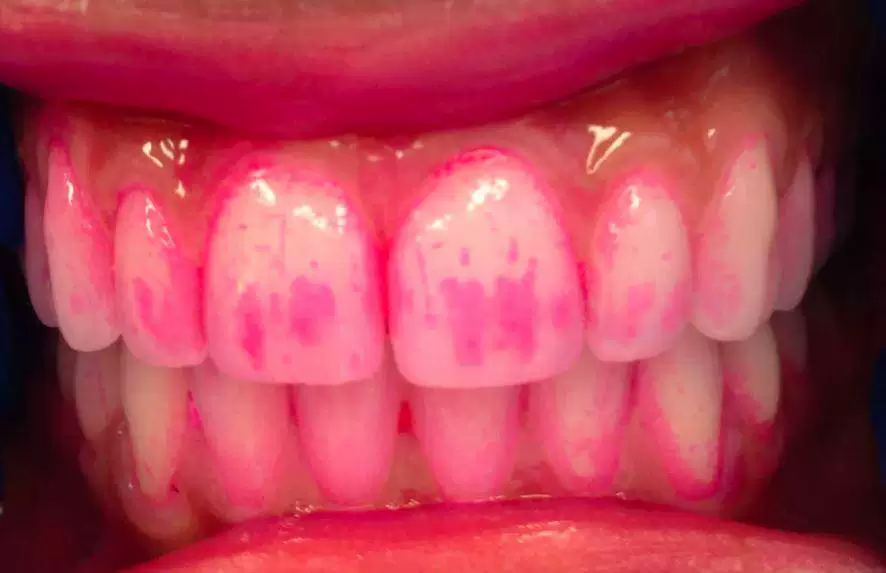

## Body

Teeth Category Identification Dataset in YOLO format

Totally 724 images, each labeled with a tag.
Divided into 7 categories, including: '1st Molar', '1st Premolar', '2nd Molar', '2nd Premolar', 'Canine', 'Central Incisor', 'Lateral Incisor'
"First molar", "First premolar", "Second molar", "Second premolar", "Canine", "Central incisor", "Lateral incisor"

Electronic virtual products are not returnable or exchangeable.

## Images

item_1039592115622

Here is a pay link on Stripe ( https://buy.stripe.com/3cs8yP7sY87d0vu9AB ). Please contact me lonlonago@foxmail.com after funding $89, and I will send you a complete data files , thank you!

